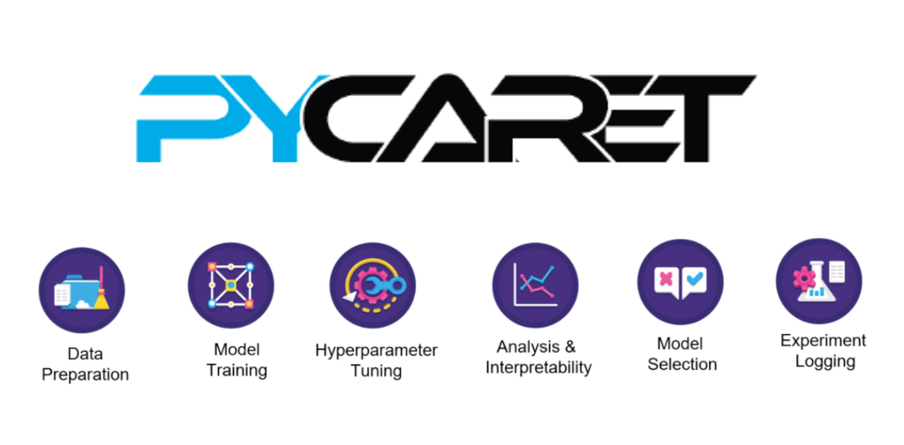

# Previsão de Doença Hepática: Simplificando a Aplicação de Machine Learning com PyCaret

    

## Introdução
A complexidade de um projeto de machine learning vai muito além da simples implementação de um modelo; diversos aspectos são considerados para alcançar resultados eficazes. O processo é exaustivo, envolvendo desde a pré-tratamento das variáveis e o balanceamento de classes até a escolha do modelo e a otimização de seus parâmetros. Cada uma dessas etapas consome tempo e exige foco do cientista de dados para garantir a implementação de um modelo eficaz.

Para resolver esses desafios, surgiu o PyCaret. O PyCaret é uma biblioteca de machine learning em Python, de código aberto e com abordagem low-code. Esta biblioteca simplifica os fluxos de trabalho em projetos de machine learning, acelerando o ciclo de experimentação de modelos e aumentando a produtividade do cientista de dados.

Para exemplificar os benefícios de se usar o PyCaret vou utilizar um projeto da Kaggle de previsão de doenças hepáticas, segue o link da base de dados no site da Kaggle e vamos ao projeto.

Lembrando que o objetivo desse post é apresentar o PyCaret e suas principais ferramentas, não vamos se atentar aos problemas da base de dados

## Etapas do Projeto
- Entendimento do Problema
- Importação das Dependências e Carregamento do Dados
- Breve entendimento sobre a base de dados
- Treinamento e Avaliação do Modelo
- Testando o modelo
- Finalização do Projeto

## Resumo Geral
Conforme mensionado anteriormente esse post tem o objetivo de apresentar a biblioteca PyCaret e aplicá-la a um projeto de machine learning de previsão de doença hepática.

A biblioteca PyCaret cumpre seu propósito estabelecido, proporcionando uma grande ajuda ao cientista de dados na construção de projetos de machine learning. É notável a rapidez com que conseguimos alcançar os melhores resultados, tornando o processo mais simples e eficiente.

Entretanto, é importante destacar que, para utilizar o PyCaret de forma eficaz, é necessário um entendimento profundo da biblioteca. O uso dos parâmetros padrão pode levar a uma certa "cegueira" do cientista de dados, que pode não compreender totalmente o que ocorre nos bastidores. Etapas como tratamento de valores faltantes, tratamento de variáveis categóricas, balanceamento da base de dados, normalização e padronização dos dados são todas fundamentais e podem ser realizadas pelo PyCaret. Esses processos impactam significativamente o desempenho do modelo e devem ser bem compreendidos e ajustados conforme necessário.

Outro fator importante é a vasta quantidade de ferramentas disponíveis nesta biblioteca. Podemos ajustar os modelos com o comando tune_model para ajustes do modelo.Podemos trabalhar com diferentes tipos de problemas, como regressão e modelos não supervisionados. Além disso, é possível integrar com a biblioteca SHAP para melhorar o processo de análise interpretativa. O PyCaret também facilita o processo de deployment, permitindo a implementação de modelos tanto localmente quanto em provedores de nuvem como AWS, GCP e Azure.

Enfim, uma ótima opção para um cientista de dados

